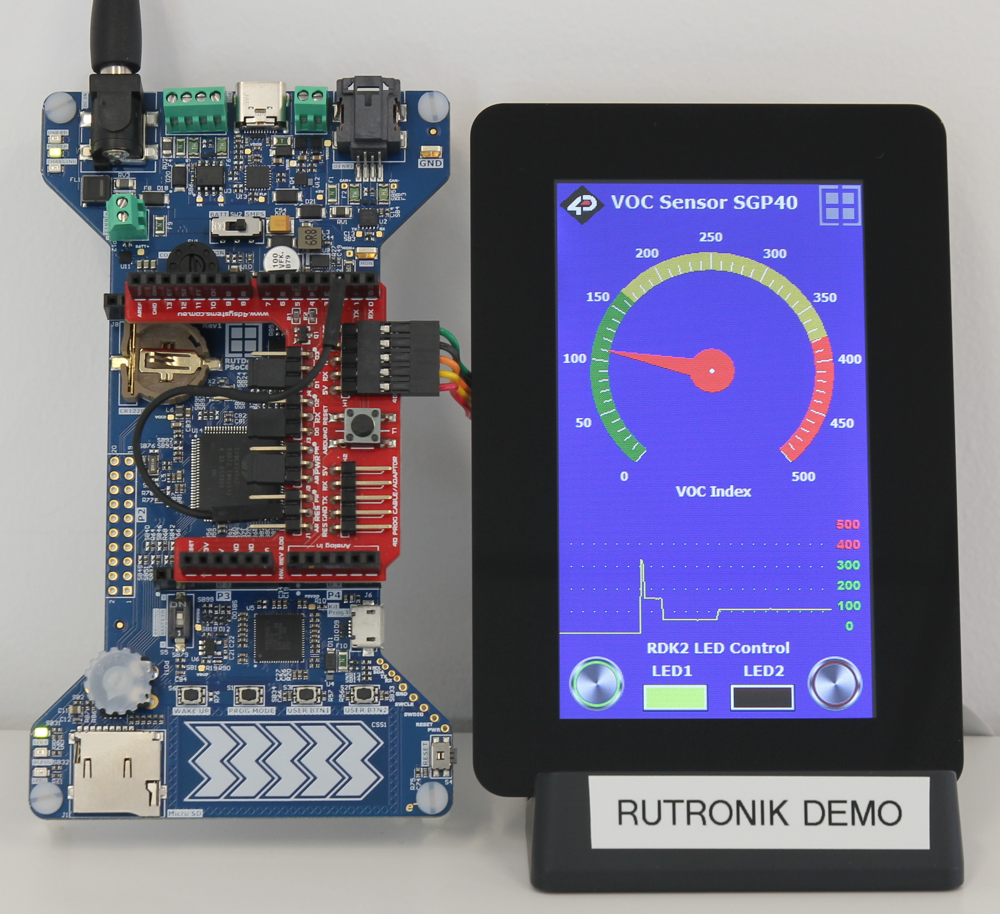
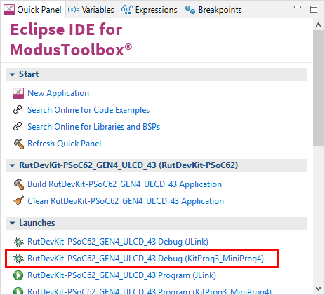

# RDK2 DIABLO16 4.3" uLCD Demo

Rutronik Development Kit Programmable System-on-Chip CY8C6245AZI-S3D72 "RDK2_GEN4_ULCD_43" Demo Application. 

Firmware example demonstrates the usage of the 4D Systems DIABLO16 graphics controller based 4.3" display with integrated capacitive touch panel - gen4-uLCD-43DCT-CLB. The display is controlled using the UART interface. The 115200 bit/s baud rate is enough for the typical application to be responsive to the touch on the display without noticeable lag. Nevertheless, the UART baud rate can be increased to 600000bit/s. For quick integration with RDK2 the Arduino adapter 4D-ARDUINO-ADAPTOR-SHIELD-II is recommended. Although the example is referring to the SGP40 sensors VOC data by default, it is also capable of automatically switching to the onboard potentiometer ADC if the sensor will not be attached to I2C.

 

The ViSi-Genie code library is provided to be used in ModusToolboxTM IDE with RDK2. The user API configuration functions and event handler has been implemented to enable the library.

```c
/* UserApiConfig */
static bool uartAvailHandler(void);
static uint8_t uartReadHandler(void);
static void uartWriteHandler(uint32_t val);
static uint32_t uartGetMillis(void);
static void resetDisplay(void);

/* Event handlers */
static void myGenieEventHandler(void);

```

The display control is executed by sending the messages to the particular objects on the screen [or background objects that may be not visible]. For example, the command that updates the „VOC Index“ gauge looks like this:

```c
/* Update the VOC Index gauge */
genieWriteObject(GENIE_OBJ_ANGULAR_METER, 0, gaugeVal);
```

The events such as touch on the buttons are received periodically executing this function:

```c
/* Check for events */
genieDoEvents(true);
```

## Requirements

- [ModusToolbox® software](https://www.infineon.com/cms/en/design-support/tools/sdk/modustoolbox-software/) v3.0

### Using the code example with a ModusToolbox IDE:

1. Import the project: **File** > **Import...** > **General** > **Existing Projects into Workspace** > **Next**.
2. Select the directory where **"RDK2_GEN4_ULCD_43"** resides and click  **Finish**.
3. Update libraries using  a **"Library Manager"** tool.
4. Select and build the project **Project ** > **Build Project**.

### Operation

The example was ported from the **"4D Systems Genie Port"** provided by Robby Chapman on GitHub:

[https://github.com/RobbyChapman/4d_systems_genie_port](https://github.com/RobbyChapman/4d_systems_genie_port)

All the graphics objects are designed and programmed to the display memory using the „Workshop4 IDE“. The provided example demonstrates the basics – a gauge for the VOC Index, the chart so-called „Scope“ which is updated every 10 seconds to be able to see how the values are changing in time. Also, a few buttons that control the onboard and on-screen LEDs are implemented to demonstrate how the Visi-Genie events work.



### Debugging

If you successfully have imported the example, the debug configurations are already prepared to use with a the KitProg3, MiniProg4, or J-link. Open the ModusToolbox perspective and find the Quick Panel. Click on the desired debug launch configuration and wait for the programming to complete and debugging process to start.



## Legal Disclaimer

The evaluation board including the software is for testing purposes only and, because it has limited functions and limited resilience, is not suitable for permanent use under real conditions. If the evaluation board is nevertheless used under real conditions, this is done at one’s responsibility; any liability of Rutronik is insofar excluded. 


